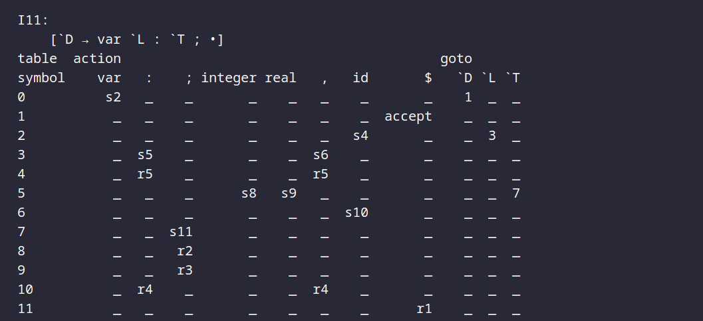
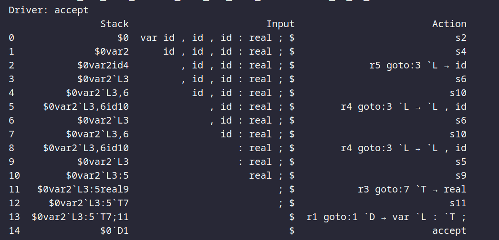

# LR(0) Parser Generator
##Prateek Kumar Singh 20CS01003
This is a Python implementation of an LR(0) parser generator. The parser generator is implemented using a set of Python modules and classes. It allows you to generate parsing tables for SLR parsing and perform parsing using those tables.

## How to Use

1. Clone the repository to your local machine or download the code files.

2. Ensure you have the required dependencies installed. The code relies on the following Python libraries:
   - `numpy`
   - `pandas`
   - `networkx` (for drawing state transition diagrams)
   - `matplotlib` (for visualizing state transition diagrams)

   You can install these dependencies using `pip`:

3. Import the necessary modules and classes from the code to use them in your project:
```python
from follow import follow_pos
from state import *
from numpy import nan
from pandas import DataFrame as df, MultiIndex

Define your grammar in the form of a string using the specified format. You can use the provided augment function to augment your grammar for SLR parsing:

grammar_str = """
`E => `E + `T 
`E => `T 
`T => `T * `F 
`T => `F 
`F => ( `E ) 
`F => id
"""
```
Generate parsing tables and perform parsing:
```python
start_state, symbols = augment(grammar_str)

start_state.closure()
states.append(start_state)
items = goto_operation()
parsing_table = parsing_table_skelton(symbols[0], symbols[1])
slr_parsing_table(items)

# Test the parser with a string
test_string = 'id + id * id'
driver_table = moves(test_string)

#You can visualize the state transitions using the draw function:
draw(states_graph)

```

<!-- insert some images using local imports -->





